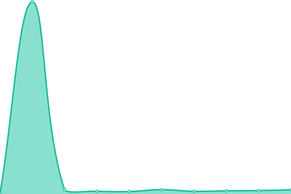
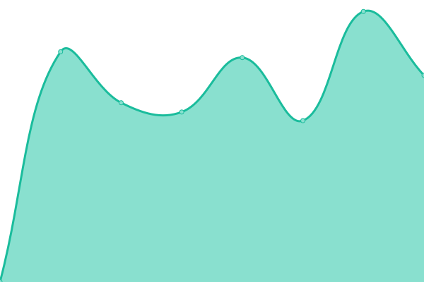
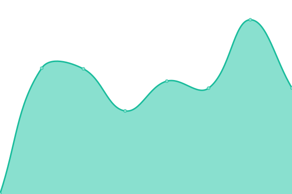

# [📈 Live Status](https://thomas-senechal.github.io/website-status): <!--live status--> **🟧 Partial outage**

This repository contains the open-source uptime monitor and status page for [Thomas Sénéchal](https://gitlab.com/thomas-senechal), powered by [Upptime](https://github.com/upptime/upptime).

With [Upptime](https://upptime.js.org), you can get your own unlimited and free uptime monitor and status page, powered entirely by a GitHub repository. We use [Issues](https://github.com/thomas-senechal/website-status/issues) as incident reports, [Actions](https://github.com/thomas-senechal/website-status/actions) as uptime monitors, and [Pages](https://thomas-senechal.github.io/website-status) for the status page.

<!--start: status pages-->
<!-- This summary is generated by Upptime (https://github.com/upptime/upptime) -->
<!-- Do not edit this manually, your changes will be overwritten -->
<!-- prettier-ignore -->
| URL | Status | History | Response Time | Uptime |
| --- | ------ | ------- | ------------- | ------ |
|  [Massa](https://massa.net) | 🟩 Up | [massa.yml](https://github.com/thomas-senechal/website-status/commits/HEAD/history/massa.yml) | 

 384ms
     
 | 

<a href="https://thomas-senechal.github.io/website-status/history/massa">100.00%</a>
    

|  [Optispace](http://optispace.fr) | 🟩 Up | [optispace.yml](https://github.com/thomas-senechal/website-status/commits/HEAD/history/optispace.yml) | 

 596ms
     
 | 

<a href="https://thomas-senechal.github.io/website-status/history/optispace">100.00%</a>
    

|  [Optispace APP](https://app.optispace.fr) | 🟥 Down | [optispace-app.yml](https://github.com/thomas-senechal/website-status/commits/HEAD/history/optispace-app.yml) | 

 0ms
     
 | 

<a href="https://thomas-senechal.github.io/website-status/history/optispace-app">0.00%</a>
    

|  [Optispace API](https://api.optispace.fr) | 🟥 Down | [optispace-api.yml](https://github.com/thomas-senechal/website-status/commits/HEAD/history/optispace-api.yml) | 

 0ms
     
 | 

<a href="https://thomas-senechal.github.io/website-status/history/optispace-api">0.00%</a>
    

<!--end: status pages-->

[**Visit our status website →**](https://thomas-senechal.github.io/website-status)

## 📄 License

- Powered by: [Upptime](https://github.com/upptime/upptime)
- Code: [MIT](./LICENSE) © [Thomas Sénéchal](https://gitlab.com/thomas-senechal)
- Data in the `./history` directory: [Open Database License](https://opendatacommons.org/licenses/odbl/1-0/)
